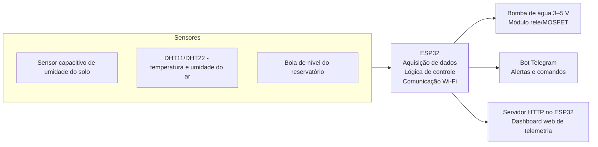
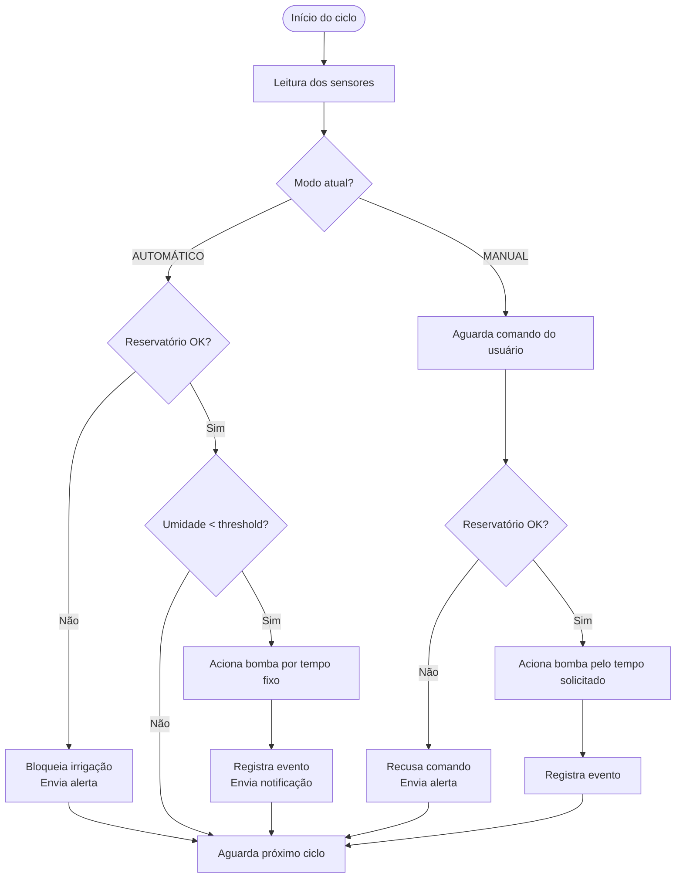
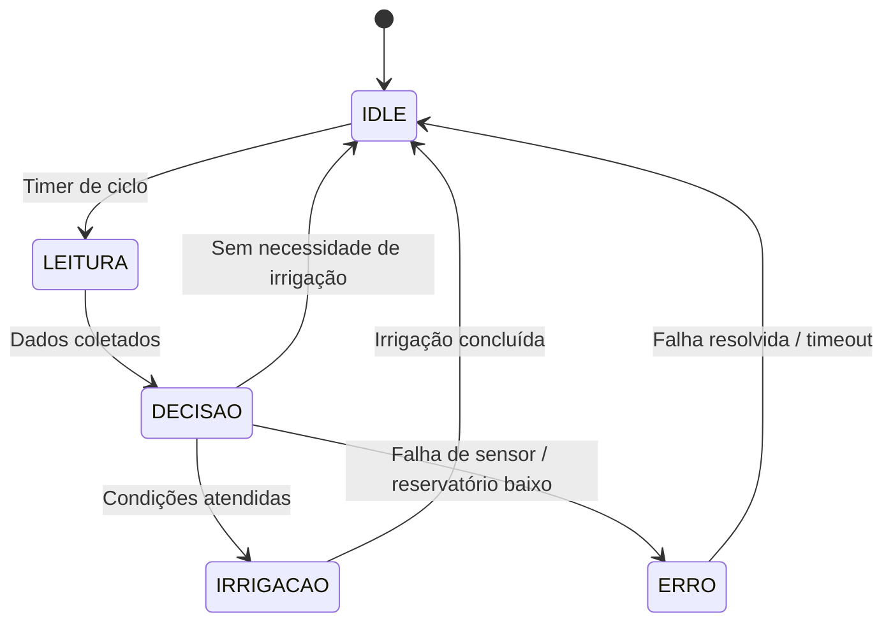
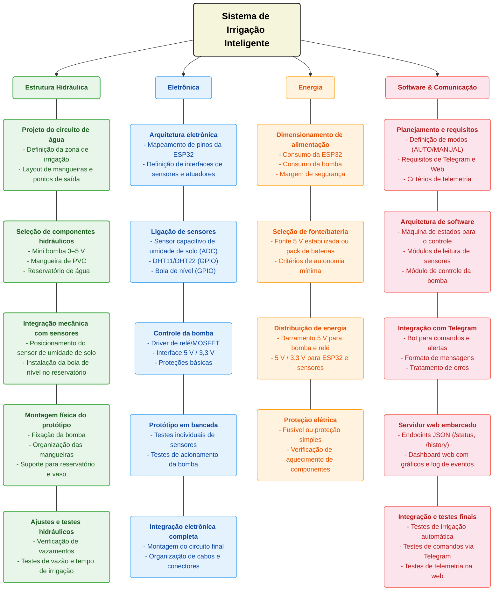
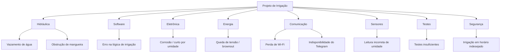
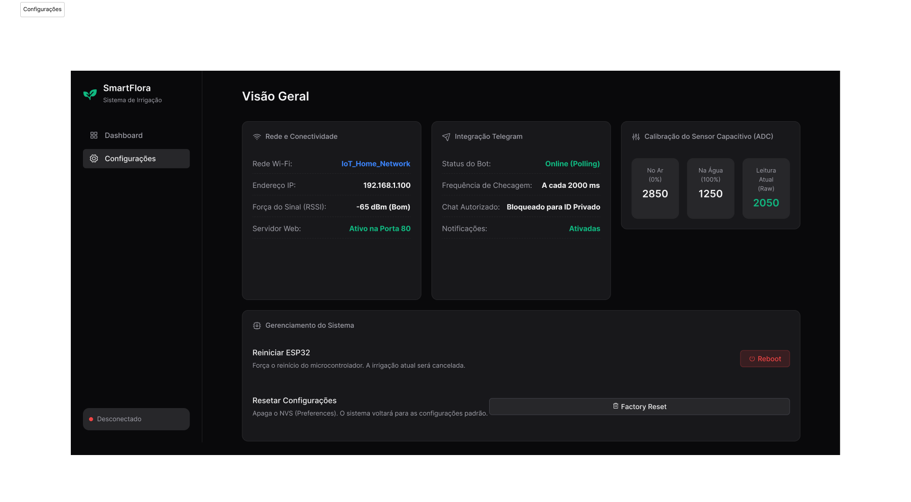
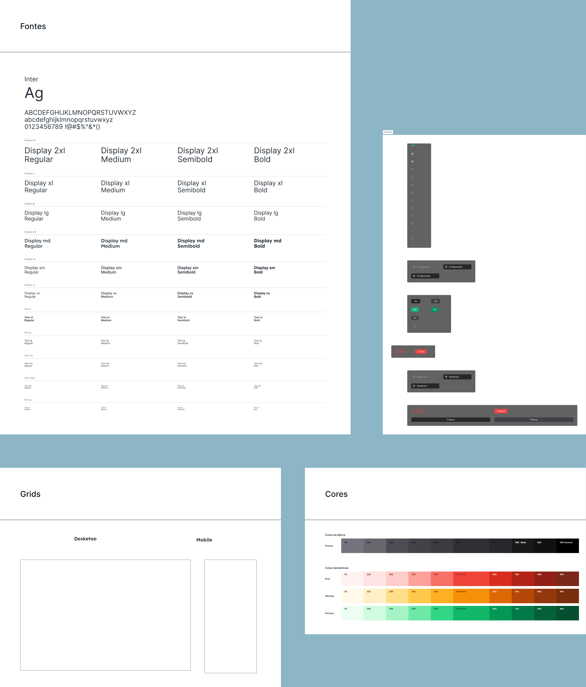

**Fundamentos de Sistemas Embarcados • UnB Gama • Trabalho 2 (2026/1)**

# Controlador de Irrigação Inteligente com ESP32

Estudo teórico e proposta de reprodução de um controlador de irrigação inteligente usando ESP32, sensores de umidade do solo, temperatura/umidade do ar e nível de água, com integração a bot no Telegram e dashboard web de telemetria.

---

## Visão Geral

O sistema proposto automatiza a irrigação de uma zona (vaso, jardineira ou pequeno canteiro) com base na
umidade do solo, monitorando também o microclima e o nível do reservatório de água.  
O ESP32 atua como unidade de controle, acionando uma mini bomba DC e disponibilizando os dados em tempo real via Telegram e interface web.


- **Automação de irrigação**  
  Acionamento automático da bomba quando o solo está abaixo de um limite configurável.

- **Monitoramento ambiental**  
  Leitura contínua da umidade do solo e da temperatura/umidade do ar.

- **Segurança do reservatório**  
  Sensor de nível com boia impede que a bomba funcione com o reservatório vazio.

- **Conectividade**  
  ESP32 conectado ao Wi‑Fi, integrando bot no Telegram e dashboard web hospedado no próprio microcontrolador.

---

## Marcos do Trabalho

| Marco | Entrega | Data Limite | Status |
|:--|:--|:--|:--|
| **Planejamento** | Escolha do produto e definição da arquitetura | **11/06/2026** | Finalizado |
| **Relatório** | Descrição, análise técnica e artigos | **01/07/2026** | Finalizado |
| **Protótipo** | Implementação com ESP32 (Entrega 03) | **11/07/2026** | Pendente |

---

## Destaques da Solução


- **Sensores simples e acessíveis**  
  Sensor capacitivo de umidade do solo, DHT11/DHT22 e boia de nível em PP, todos compatíveis com ESP32.

- **Atuador de baixo custo**  
  Mini bomba submersível 3–5 V controlada via relé/MOSFET, ideal para protótipos acadêmicos e irrigação de pequenos volumes.

- **Bot no Telegram**  
  Alertas de solo seco, fim de irrigação e reservatório baixo, além de comandos como `/status` e `/regar_20s` para controle manual.

- **Dashboard Web de Telemetria**  
  Interface web com gráficos de umidade do solo e temperatura/umidade do ar, log de eventos de irrigação e visualização do estado atual do sistema.

---

## Acesso Rápido


- **Documentação do Trabalho**

  - [Descrição do produto](descricao-produto.md)
  - [Funcionamento técnico](funcionamento.md)
  - [Proposta de reprodução com ESP32](reproducao-esp32.md)
  - [Requisitos funcionais e não funcionais](requisitos.md)
  - [Estrutura Analítica do Projeto (EAP)](eap.md)
  - [Normas técnicas aplicadas](normas.md)
  - [Análise de riscos](analiseriscos.md)
  - [Comparativo com produtos similares](comparativo.md)
  - [Pesquisa bibliográfica](pesquisa-bibliografica.md)
  - [Protótipo de site de telemetria](prototipo-site.md)

---

## Equipe

| <a href="https://github.com/GabrielSMonteiro"></a> | <a href="https://github.com/bigkaio"></a> | <a href="https://github.com/alvezclari"></a> | <a href="https://github.com/devwallyson"></a> |
|:---:|:---:|:---:|:---:|
| [Gabriel Monteiro](https://github.com/GabrielSMonteiro) | [Kaio](https://github.com/bigkaio) | [Maria Clara](https://github.com/alvezclari) | [Wallyson](https://github.com/devwallyson) |
| 221021975 | 222006893 | 221008329 | 222006196 |
| Responsável Software / Web | Pesquisa Bibliográfica | Descrição / Comparativo | Análise Técnica |

---

## Tecnologias Utilizadas

<div align="center">
  
  
  
  
</div>

# 1. Descrição do Produto

## 1.1 Visão geral

O produto é um **Controlador de Irrigação Inteligente** para uma zona de cultivo (vaso, canteiro ou pequena horta), capaz de monitorar as condições do solo e do ambiente em tempo real e acionar automaticamente a irrigação quando necessário, eliminando a necessidade de regar manualmente em horários fixos e independente da real necessidade da planta.

O sistema combina sensoriamento ambiental, lógica de decisão embarcada e múltiplos canais de interação com o usuário (bot no Telegram e dashboard web), reproduzindo em escala reduzida as funcionalidades centrais de controladores de irrigação comerciais (ex. Rain Bird, Rachio, Orbit B-Hyve), descritos na [Seção 5 — Comparativo](./comparativo.md).

## 1.2 Funções principais

- **Monitoramento contínuo** da umidade do solo, temperatura e umidade do ar, e nível do reservatório de água.
- **Irrigação automática**: aciona a bomba quando a umidade do solo cai abaixo de um limiar configurável (threshold), respeitando histerese para evitar acionamentos repetidos.
- **Irrigação manual**: permite ao usuário regar por um tempo determinado via comando no Telegram ou botão no dashboard web, desde que o reservatório esteja em nível seguro.
- **Bloqueio de segurança**: suspende a irrigação automática em caso de reservatório com nível baixo ou leituras de sensores inválidas/inconsistentes.
- **Notificações automáticas** de eventos relevantes (solo seco, irrigação concluída, reservatório baixo, falhas de sensor).
- **Histórico e telemetria**: registra e disponibiliza amostras de sensores e eventos de irrigação para consulta posterior.

## 1.3 Público-alvo

- Pessoas que cultivam plantas em casa, apartamento ou pequenos jardins e querem automatizar a rega sem depender de memória ou disponibilidade para regar manualmente.
- Pequenos produtores e entusiastas de hortas domésticas/urbanas interessados em economia de água e em soluções de automação de baixo custo.
- Estudantes e makers interessados em projetos de IoT/sistemas embarcados aplicados à agricultura, por ser uma solução open-source, replicável e de baixo custo em comparação aos produtos comerciais do mercado.

## 1.4 Componentes do sistema

| Componente | Função |
|---|---|
| **ESP32 DevKit V1** | Microcontrolador central: lê sensores, controla a bomba, conecta-se ao Wi-Fi, hospeda o dashboard web e integra com o Telegram. |
| **Sensor capacitivo de umidade do solo** | Mede a umidade do solo (saída analógica via ADC), entrada principal da lógica de decisão. |
| **Sensor de temperatura e umidade do ar (DHT11/DHT22)** | Fornece dados do microclima ao redor da planta (saída digital via GPIO). |
| **Sensor de nível de água (boia de nível)** | Indica se o reservatório está em nível seguro ou baixo, usado como trava de segurança. |
| **Mini bomba de água submersível (3–5 V)** | Atuador responsável por bombear a água até a planta. |
| **Módulo relé / driver MOSFET** | Interface entre o ESP32 (3,3 V) e a bomba (5 V), permitindo o acionamento seguro do atuador. |
| **Mangueira de PVC** | Conduz a água da bomba até o vaso ou canteiro. |

Mais detalhes sobre a arquitetura de hardware e software estão na [Seção 3 — Reprodução com ESP32](./reproducao-esp32.md).

## 1.5 Tecnologias de comunicação

- **Wi-Fi**: conectividade principal do ESP32, utilizada tanto para hospedar o dashboard web local quanto para a comunicação com a API do Telegram.
- **HTTP**: protocolo usado pelo dashboard web (servidor embarcado no ESP32) e pela integração com a API do Telegram (bot).
- **API REST/JSON**: o ESP32 expõe endpoints (`/api/status`, `/api/history`) que retornam o estado do sistema e o histórico de leituras em formato JSON, consumidos pelo próprio dashboard.
- **Telegram Bot API**: canal de comunicação remota por mensagens, permitindo consultar status (`/status`), alternar modos de operação (`/modo_auto`, `/modo_manual`) e acionar irrigação manual (`/regar_10s`, `/regar_20s`).

Essas escolhas combinam sensoriamento local e protocolos leves como HTTP para comunicação direta com o usuário, sem dependência de serviços em nuvem (ver [Seção 4 — Pesquisa Bibliográfica](./pesquisa-bibliografica.md)).

---

| Versão | Autor | Data |
| --- | --- | --- |
| 0.1 | [Wallyson](https://github.com/devwallyson) | 30/06/2026 |
# 2. Funcionamento Técnico do Sistema

## Introdução

Este documento descreve o funcionamento técnico do **Controlador de Irrigação Inteligente com ESP32**, detalhando a arquitetura geral do sistema, os fluxos de dados entre os subsistemas e a lógica de operação que governa a irrigação automática e manual.

O objetivo é fornecer uma visão consolidada de como os componentes de hardware (sensores, atuadores, microcontrolador) se integram com as camadas de software (firmware, comunicação, interface) para entregar as funcionalidades descritas nos [requisitos do projeto](requisitos.md).

---

## Diagrama Conceitual do Sistema

O diagrama abaixo apresenta a visão geral da arquitetura, mostrando os três blocos principais — **Sensores**, **ESP32** e **Saídas** — e os fluxos de dados entre eles.



---

## Fluxo de Operação

O sistema opera em um ciclo contínuo dividido em quatro etapas principais, executadas periodicamente (a cada 30–60 segundos):

### 1. Aquisição de Dados

O ESP32 lê os três sensores conectados:

| Sensor | Interface | Dado obtido |
|---|---|---|
| Sensor capacitivo de umidade do solo | ADC (analógico) | Umidade do solo (0–100%) |
| DHT11 / DHT22 | GPIO (digital) | Temperatura (°C) e umidade relativa do ar (%) |
| Boia de nível | GPIO (`INPUT_PULLUP`) | Estado do reservatório (OK / Baixo) |

As leituras do sensor de umidade do solo passam por uma etapa de filtragem (média móvel) para eliminar ruídos e variações bruscas, garantindo decisões de irrigação mais confiáveis.

### 2. Decisão de Irrigação

Com os dados coletados, o ESP32 executa a lógica de decisão conforme o modo de operação ativo:



**Regras de segurança aplicadas em ambos os modos:**

- A bomba nunca é acionada se o reservatório estiver com nível baixo.
- Em caso de leituras consecutivas inválidas dos sensores, o modo automático é suspenso até recalibração.
- Um tempo máximo de irrigação por ciclo é imposto para evitar superaquecimento da bomba.
- Histerese é aplicada no modo automático para evitar acionamentos repetidos (intervalo mínimo entre irrigações).

### 3. Acionamento do Atuador

O acionamento da bomba de água é feito de forma indireta, através de um módulo relé ou driver MOSFET:

```
ESP32 (GPIO 3,3 V)  →  Módulo Relé/MOSFET  →  Bomba 5 V DC
```

O GPIO do ESP32 envia um sinal de controle ao módulo relé, que comuta a alimentação de 5 V para a bomba. A bomba nunca é alimentada diretamente pelo GPIO para proteção do microcontrolador.

### 4. Comunicação e Telemetria

Após cada ciclo de leitura e decisão, o ESP32 atualiza os canais de comunicação:

**Bot no Telegram:**
- Envia notificações automáticas em eventos relevantes (solo seco, irrigação concluída, reservatório baixo).
- Responde a comandos do usuário (`/status`, `/modo_auto`, `/modo_manual`, `/regar_20s`).

**Dashboard Web (servidor HTTP embarcado):**
- Atualiza os endpoints da API REST (`/api/status`, `/api/history`) com os dados mais recentes.
- A página web consulta esses endpoints periodicamente para exibir gráficos e indicadores em tempo real.

---

## Diagrama de Estados do Sistema

O firmware do ESP32 é organizado como uma máquina de estados finita (FSM) com os seguintes estados:



| Estado | Descrição |
|---|---|
| **IDLE** | Aguarda o próximo ciclo de leitura. O sistema monitora comandos do Telegram e requisições web. |
| **LEITURA** | Executa a leitura de todos os sensores e aplica filtragem. |
| **DECISÃO** | Avalia as condições de irrigação conforme o modo ativo e as regras de segurança. |
| **IRRIGAÇÃO** | Aciona a bomba pelo tempo determinado, registra o evento e envia notificações. |
| **ERRO** | Estado de falha: bloqueia irrigação automática, registra o erro e tenta recuperação. |

---

## Distribuição de Energia

O sistema utiliza uma fonte de 5 V estabilizada que alimenta dois barramentos:

| Barramento | Componentes | Tensão |
|---|---|---|
| **Potência** | Bomba de água, módulo relé | 5 V |
| **Sinal** | ESP32, sensores (umidade, DHT, boia) | 3,3 V (regulador interno do ESP32) |

A separação entre os barramentos de potência e sinal minimiza interferências eletromagnéticas causadas pelo acionamento da bomba e do relé, prevenindo resets indesejados do ESP32.

---

## Histórico de Versões

**Tabela 1** - Histórico de versões.

| Versão | Descrição | Autor(es) | Data |
| :----: | :-------: | :-------: | :--: |
|  1.0   | Criação do documento de funcionamento técnico | [Gabriel Santos Monteiro](https://github.com/GabrielSMonteiro) | 30/06/2026 |
# 3. Proposta de Reprodução (ESP32)

### 3.1 Visão geral da solução

Propomos reproduzir as principais funcionalidades de um controlador de irrigação inteligente comercial (uma zona de irrigação) utilizando um microcontrolador **ESP32**, sensores simples e uma bomba de água DC de baixa potência.

O sistema fará leitura contínua da umidade do solo, temperatura e umidade do ar, além do nível do reservatório, e usará esses dados para acionar automaticamente a irrigação quando necessário, permitindo também controle manual via **bot no Telegram** e um **dashboard web** hospedado pelo próprio ESP32.

***

### 3.2 Arquitetura de hardware proposta

**Componentes principais:**

- **ESP32 DevKit V1**  
  - Responsável por ler sensores, controlar a bomba, conectar ao Wi‑Fi, servir o site de telemetria e integrar com o Telegram.

- **Sensor capacitivo de umidade do solo**  
  - Alimentado em 3,3–5 V, saída analógica conectada a um canal ADC do ESP32.  
  - Permite medir a umidade do solo em tempo real, sendo amplamente utilizado em projetos de irrigação com ESP32.

- **Sensor de temperatura e umidade do ar (DHT11 ou DHT22)**  
  - Saída digital ligada a um GPIO do ESP32.  
  - Fornece temperatura ambiente e umidade relativa, dados usados para monitorar o microclima da planta.

- **Sensor de nível de água (boia de nível em PP)**  
  - Boia horizontal em polipropileno, contato seco, com especificação típica de até 10 W / 0,5 A em 110 VDC.
  - Ligada entre GND e um GPIO configurado como `INPUT_PULLUP` no ESP32, indicando se o reservatório está em nível seguro ou baixo.

- **Mini bomba de água submersível 3–5 V**  
  - Bomba DC com tensão de operação 3–5 V, corrente ~100–200 mA, vazão ~1,2–1,6 L/min e altura de coluna d’água de 0,3–0,8 m.
  - Alimentada por 5 V e comutada por um módulo relé ou driver MOSFET, nunca diretamente pelo GPIO do ESP32.

- **Módulo relé 1 canal 5 V (ou driver MOSFET)**  
  - Interface entre o ESP32 (3,3 V) e a bomba (5 V), permitindo ligar/desligar a bomba de forma segura.

- **Mangueira de PVC 1 m**  
  - Diâmetro interno compatível com a saída da bomba (~5–5,5 mm), utilizada para conduzir a água até o vaso/canteiro.

Essa arquitetura combina sensores de solo, bomba DC e relé, formando um circuito de controle completo para irrigação automatizada.

***

### 3.3 Arquitetura de software e lógica de controle

O software será dividido em três camadas principais:

1. **Camada de aquisição de dados (sensores)**  
   - Rotinas periódicas (por exemplo, a cada 30–60 s) para:
     - Ler o valor analógico do sensor de umidade do solo e normalizar para uma escala de 0–100%.  
     - Ler temperatura e umidade do ar via DHT.  
     - Ler o estado do sensor de nível (boia) para determinar se o reservatório está OK ou baixo.

2. **Camada de decisão e controle da bomba**  
   - Dois modos de operação:
     - **Automático:**  
       - Se `umidade_solo < threshold` (por ex. 30%), reservatório OK e bomba desligada, aciona irrigação automática por um tempo fixo (ex. 20 s), desliga e relê o valor de umidade.
       - Pode usar histerese simples para evitar liga/desliga frequente (só reativar após um intervalo mínimo).  
     - **Manual:**  
       - Bomba ligada apenas por ação do usuário (botão local, comando no Telegram ou botão no site), mantendo as condições de segurança (reservatório não pode estar baixo).
   - Em caso de falha de sensores (várias leituras inválidas) ou reservatório baixo, o sistema bloqueia irrigação automática e registra o evento.

3. **Camada de comunicação (Telegram + Web)**  
   - Responsável por expor o estado do sistema, receber comandos e enviar eventos relevantes ao usuário.

***

### 3.4 Integração com bot no Telegram

O ESP32 será configurado para se conectar à API do Telegram utilizando HTTP sobre Wi‑Fi, atuando como cliente do bot.

**Comandos previstos:**

- `/status`  
  - Retorna um resumo textual do estado atual:
    - Umidade do solo (%).  
    - Temperatura e umidade do ar.  
    - Estado da bomba (ligada/desligada).  
    - Modo de operação (AUTO/MANUAL).  
    - Nível do reservatório (OK/baixo).  
    - Hora e tipo da última irrigação.  

- `/modo_auto` e `/modo_manual`  
  - Alternam o modo de operação e respondem com confirmação, informando o threshold de umidade configurado.

- `/regar_10s`, `/regar_20s`  
  - Acionam a bomba no modo manual por um tempo específico, respeitando a condição de reservatório.

- Opcional: `/set_threshold 30`  
  - Ajusta o valor do threshold de umidade do solo.

**Notificações automáticas:**

- Solo seco detectado (antes da irrigação automática).  
- Fim da irrigação automática (informando valores antes/depois).  
- Reservatório em nível baixo (bloqueio da irrigação).  
- Erros persistentes de sensores ou falhas críticas.  

Essa integração permite que o usuário acompanhe o sistema remotamente e receba alertas em tempo real diretamente no celular.

***

### 3.5 Interface web de telemetria

A proposta é que o **próprio ESP32** hospede um servidor HTTP simples, fornecendo uma página web com dashboard e endpoints de API em JSON.

**Endpoints sugeridos:**

- `GET /`  
  - Retorna a página HTML/JS/CSS do dashboard.

- `GET /api/status`  
  - JSON com estado atual:
    - `soil_moisture` (0–100%).  
    - `air_temperature` (°C).  
    - `air_humidity` (%).  
    - `pump_state` (ON/OFF).  
    - `mode` (AUTO/MANUAL).  
    - `water_level_ok` (boolean).  
    - `moisture_threshold` atual.

- `GET /api/history`  
  - JSON com:
    - Lista das últimas N amostras (timestamp, umidade do solo, temperatura, umidade, estado da bomba).  
    - Lista de eventos de irrigação (tipo AUTO/MANUAL, duração, umidade antes/depois).

- Opcional: `POST /api/control`  
  - Para ações como ligar bomba manualmente e alternar modo (com validação simples).

**Elementos do dashboard:**

- Gráfico de linha de umidade do solo vs. tempo (últimas horas).  
- Gráfico de temperatura e umidade do ar vs. tempo.  
- Indicadores de estado (bomba, modo, reservatório).  
- Tabela de eventos de irrigação (hora, tipo, duração, umidade antes/depois).  
- Botões de ação (regar por X segundos, mudar modo), se o grupo optar por permitir controle via web.

Essa abordagem permite monitoramento e controle do sistema sem depender de servidores externos ou serviços em nuvem.

***

### 3.6 Diagrama conceitual do sistema (descrição textual)

O diagrama conceitual proposto é um diagrama de blocos com os seguintes elementos e relações:

- **Bloco “Sensores”**  
  - Sensor de umidade do solo  
  - DHT11/DHT22  
  - Boia de nível  

- **Bloco “ESP32”**  
  - Módulo de aquisição de dados (ADC + GPIO).  
  - Módulo de lógica de controle (modo AUTO/MANUAL, thresholds).  
  - Módulos de comunicação (Wi‑Fi, Telegram, servidor HTTP).  

- **Bloco “Atuadores”**  
  - Módulo relé/MOSFET.  
  - Bomba de água submersível.  

- **Bloco “Interface Telegram”**  
  - Usuário interage com o bot para receber status e enviar comandos.  

- **Bloco “Interface Web”**  
  - Usuário acessa o dashboard para visualizar telemetria e histórico, e opcionalmente enviar comandos.  

Fluxos principais:

- Sensores → ESP32 (leituras periódicas).  
- ESP32 → Atuadores (comando liga/desliga bomba).  
- ESP32 ↔ Telegram (mensagens de status/comando).  
- ESP32 ↔ Navegador (API JSON + página web).  

***

### 3.7 Limitações e desafios esperados

- **Precisão e calibração dos sensores de umidade do solo**  
  - Sensores capacitivos simples são influenciados por tipo de solo, salinidade e posicionamento, exigindo calibração prática para mapear a leitura analógica para percentual de umidade confiável.

- **Cobertura de Wi‑Fi**  
  - O ESP32 depende de uma rede Wi‑Fi estável; em ambientes externos ou rurais, pode haver perda de conectividade, afetando o envio de dados para o Telegram e acesso ao dashboard.

- **Latência e uso de recursos na ESP32**  
  - Hospedar servidor HTTP, lógica de controle e integração com Telegram em um único ESP32 exige cuidado com uso de memória, tempo de CPU e tratamento de falhas.

- **Proteção elétrica e robustez**  
  - Bomba e relé geram ruído elétrico; é necessário projetar o hardware com proteção mínima (diodo de flyback, fonte adequada) para evitar resets aleatórios do ESP32.

- **Escalabilidade**  
  - O protótipo é pensado para uma única zona de irrigação; a extensão para múltiplas zonas exigiria mais sensores, válvulas e lógica mais complexa de agendamento.

Essa proposta, apesar dessas limitações, é compatível com o escopo prático da disciplina e permite a construção de um protótipo funcional de irrigação inteligente.

<div align="center">

| Versão | Autor | Data |
| --- | --- | --- |
| 0.1 | [Gabriel Monteiro](https://github.com/GabrielSMonteiro) | 24/06/2026 |

# Levantamento de Requisitos Funcionais e Não Funcionais

## 1. Visão Geral da Missão

O objetivo deste projeto é desenvolver um **sistema de irrigação inteligente** capaz de monitorar umidade do solo, temperatura/umidade do ar e nível do reservatório, acionando uma bomba de água de forma automática ou manual para irrigar uma zona específica (vaso, jardineira ou pequeno canteiro).  

A missão do sistema consiste em:

- Ler continuamente os sensores;
- Decidir quando irrigar com base em thresholds configuráveis;
- Garantir que o reservatório possui água suficiente;
- Expor o estado via **bot no Telegram** e **dashboard web**;
- Permitir intervenção manual segura pelo usuário.

Os requisitos funcionais (Seção 2) descrevem as funcionalidades que o sistema deve oferecer; os requisitos não funcionais (Seção 3) tratam de atributos de qualidade, restrições técnicas e desempenho.

### 1.1. Identificação dos Requisitos

Por convenção, cada requisito é identificado pelo código da categoria e um número sequencial:

- Requisitos funcionais: **[RF01]**, **[RF02]**, ...
- Requisitos não funcionais: **[RNF01]**, **[RNF02]**, ...

A referência será feita no formato:

> [nome da subseção / identificador do requisito]

### 1.2. Prioridade dos Requisitos

As prioridades adotadas são:

- **Essencial:** indispensável para o funcionamento básico do sistema.
- **Importante:** relevante para desempenho e usabilidade, mas não inviabiliza totalmente o funcionamento se ausente.
- **Desejável:** agrega valor, mas pode ser postergado para versões futuras.

---

## 2. Requisitos Funcionais (RF)

### 2.1. RF01 – Leitura de Umidade do Solo
O sistema deve ler periodicamente o valor de um **sensor capacitivo de umidade do solo**, convertendo-o para uma escala interpretável (por exemplo, 0–100%).  

### 2.2. RF02 – Leitura de Temperatura e Umidade do Ar
O sistema deve ler periodicamente dados de um sensor do tipo **DHT11 ou DHT22**, obtendo temperatura em graus Celsius e umidade relativa do ar.

### 2.3. RF03 – Monitoramento do Nível do Reservatório
O sistema deve monitorar o estado do reservatório por meio de um **sensor de boia de nível**, indicando se há água suficiente para irrigação.

### 2.4. RF04 – Irrigação Automática
O sistema deve acionar a bomba de água automaticamente quando a umidade do solo estiver abaixo de um threshold configurável e o reservatório estiver em nível seguro.

### 2.5. RF05 – Controle Manual de Irrigação
O sistema deve permitir o acionamento manual da bomba por meio de comandos via **bot no Telegram** e/ou botões na interface web.

### 2.6. RF06 – Alternância de Modos de Operação
O sistema deve permitir alternar entre modo **AUTOMÁTICO** e **MANUAL**, mantendo registro do modo atual.

### 2.7. RF07 – Proteção contra Reservatório Vazio
O sistema deve impedir o acionamento da bomba (automático ou manual) quando o sensor de nível indicar reservatório vazio ou abaixo do mínimo.

### 2.8. RF08 – Notificações via Telegram
O sistema deve enviar notificações via bot no Telegram em eventos relevantes, como:
- solo seco detectado;
- início e fim de irrigação;
- reservatório em nível baixo;
- erro de leitura de sensor.

### 2.9. RF09 – Comando de Status via Telegram
O sistema deve responder ao comando `/status` no Telegram com um resumo dos principais parâmetros (umidade do solo, temperatura, umidade do ar, modo, estado da bomba e nível do reservatório).

### 2.10. RF10 – Dashboard Web
O sistema deve disponibilizar uma interface web embarcada, acessível em rede local, mostrando valores atuais de sensores, estado do sistema e gráfico de histórico recente.

### 2.11. RF11 – Registro de Eventos de Irrigação
O sistema deve registrar em memória (histórico) os eventos de irrigação (tipo AUTO/MANUAL, duração, umidade antes/depois), para consulta posterior na interface web.

### 2.12. RF12 – Configuração de Thresholds
O usuário deve poder configurar, através de interface (Telegram ou web), o valor do threshold de umidade do solo utilizado na irrigação automática.

---

## 3. Requisitos Não Funcionais (RNF)

### 3.1. RNF01 – Dimensões do Protótipo
O conjunto (reservatório pequeno + vaso + estrutura eletrônica) deve possuir dimensões adequadas à bancada/laboratório, com footprint máximo aproximado de 50 × 50 cm.

### 3.2. RNF02 – Autonomia de Operação
O sistema deve operar continuamente por, no mínimo, 1 hora em condições normais de uso (ciclos de leitura e alguns ciclos de irrigação).

### 3.3. RNF03 – Capacidade de Bombeamento
A bomba deve ser capaz de fornecer vazão suficiente para irrigar a zona de interesse em poucos minutos, mantendo uma coluna d’água adequada às especificações típicas de bombas 3–5 V usadas em projetos com ESP32.  

### 3.4. RNF04 – Estabilidade das Leituras de Solo
As leituras do sensor de umidade devem apresentar estabilidade adequada após filtragem (por exemplo, sem variações bruscas não justificadas), garantindo decisões confiáveis de irrigação.  

### 3.5. RNF05 – Plataforma de Processamento
O sistema deve utilizar um microcontrolador **ESP32 DevKit** como plataforma principal.

### 3.6. RNF06 – Alimentação Elétrica
O sistema deve utilizar fonte/bateria com tensão e corrente compatíveis com ESP32 e bomba, além de reguladores adequados para evitar queda excessiva de tensão.

### 3.7. RNF07 – Latência de Comandos via Telegram
O tempo entre o envio de um comando de irrigação (por exemplo, `/regar_20s`) e o acionamento da bomba não deve exceder 2 segundos em condições de Wi‑Fi estável.

### 3.8. RNF08 – Estabilidade da Conexão Web
A interface web deve se manter acessível enquanto o ESP32 estiver ligado e conectado ao Wi‑Fi, com tempo máximo de resposta de 1 segundo para consultas de status.

### 3.9. RNF09 – Segurança Operacional
O sistema deve interromper automaticamente a irrigação em caso de falha crítica detectada (por exemplo, leitura impossível dos sensores de solo ou nível).

### 3.10. RNF10 – Proteção contra Água na Eletrônica
A caixa eletrônica deve ser projetada de forma a minimizar risco de respingos diretos de água em placas, mantendo pelo menos proteção equivalente a uso em ambiente interno.

### 3.11. RNF11 – Recuperação de Falhas
Após falhas não críticas (por exemplo, perda temporária de Wi‑Fi), o sistema deve retomar seu funcionamento normal sem necessidade de intervenção física.

### 3.12. RNF12 – Registro Mínimo de Histórico
O sistema deve ser capaz de manter em memória pelo menos as últimas 100 amostras de sensores e 20 eventos de irrigação para exibição no dashboard.

### 3.13. RNF13 – Modularidade de Código
O firmware deve ser estruturado em módulos (leitura de sensores, controle de bomba, Telegram, Web) permitindo manutenção e evolução.

---

## 4. Matriz de Classificação dos Requisitos

### 4.1. Classificação dos Requisitos Funcionais

| Código | Requisito                      | Classificação  | Justificativa                                                        |
| ------ | ------------------------------ | -------------- | -------------------------------------------------------------------- |
| RF01   | Leitura de umidade do solo    | **Essencial**  | Base da lógica de irrigação automática                              |
| RF02   | Leitura de temperatura/umidade| **Importante** | Melhora o monitoramento ambiental, mas não impede irrigação         |
| RF03   | Monitoramento do reservatório | **Essencial**  | Evita funcionamento da bomba sem água                               |
| RF04   | Irrigação automática          | **Essencial**  | Principal funcionalidade inteligente do sistema                     |
| RF05   | Controle manual               | **Importante** | Necessário para testes e override humano                            |
| RF06   | Alternância de modos          | **Essencial**  | Garante flexibilidade entre operação automática e manual            |
| RF07   | Proteção contra reservatório vazio | **Essencial** | Protege bomba e evita danos                                         |
| RF08   | Notificações via Telegram     | **Importante** | Melhora observabilidade do sistema                                  |
| RF09   | Comando de status             | **Importante** | Facilita monitoramento remoto                                       |
| RF10   | Dashboard web                 | **Importante** | Atende requisito de telemetria e visualização                       |
| RF11   | Registro de eventos de irrigação | **Importante** | Permite análise de comportamento e validação                        |
| RF12   | Configuração de thresholds    | **Essencial**  | Necessário para ajustar irrigação às condições reais                |

### 4.2. Classificação dos Requisitos Não Funcionais

| Código | Requisito                             | Classificação  | Justificativa                                                |
| ------ | ------------------------------------- | -------------- | ------------------------------------------------------------ |
| RNF01  | Dimensões do protótipo               | **Importante** | Facilita uso em bancada e armazenamento                     |
| RNF02  | Autonomia de operação                | **Essencial**  | Necessária para monitoramento e irrigação ao longo do tempo |
| RNF03  | Capacidade de bombeamento            | **Essencial**  | Garante irrigação eficaz                                     |
| RNF04  | Estabilidade das leituras de solo    | **Essencial**  | Evita decisões erradas de irrigação                         |
| RNF05  | Plataforma ESP32                     | **Importante** | Define arquitetura principal, mas poderiam existir variantes |
| RNF06  | Alimentação elétrica                 | **Essencial**  | Garante funcionamento estável                                |
| RNF07  | Latência de comandos via Telegram    | **Importante** | Impacta experiência de controle remoto                       |
| RNF08  | Estabilidade da conexão web          | **Importante** | Impacta visualização de telemetria                           |
| RNF09  | Segurança operacional                 | **Essencial**  | Protege sistema e ambiente                                   |
| RNF10  | Proteção contra água na eletrônica   | **Essencial**  | Previne falhas por umidade                                   |
| RNF11  | Recuperação de falhas                | **Importante** | Aumenta robustez                                             |
| RNF12  | Registro mínimo de histórico         | **Importante** | Necessário para análise básica de telemetria                 |
| RNF13  | Modularidade de código               | **Desejável**  | Facilita manutenção, mas não impede operação                 |

---

## 5. Histórico de Versionamento

| Versão | Data       | Autor(es)                             | Descrição das Alterações                        |
| ------ | ---------- | ------------------------------------- | ----------------------------------------------- |
| 0.1    | 30/06/2026 | Gabriel Santos Monteiro               | Criação inicial do documento de requisitos      |
| 0.2    | 30/06/2026 | Gabriel Santos Monteiro               | Adição dos requisitos funcionais                |
| 0.3    | 30/06/2026 | Gabriel Santos Monteiro               | Adição dos requisitos não funcionais e matrizes |
# Estrutura Analítica do Projeto (EAP)

## Introdução

Este documento apresenta a Estrutura Analítica do Projeto (EAP) para o desenvolvimento de um **controlador de irrigação inteligente com ESP32**, organizando as principais atividades necessárias para sua execução.

A EAP divide o projeto em quatro áreas principais — **Estrutura Hidráulica**, **Eletrônica**, **Energia** e **Software & Comunicação** — permitindo uma visão clara das etapas, melhor planejamento e acompanhamento das atividades.

Essa organização contribui para o controle do escopo, a integração entre os subsistemas e a condução eficiente do projeto até sua entrega prática na disciplina.

---



## Histórico de Versões

**Tabela 1** - Histórico de versões.

| Versão | Descrição | Autor(es) | Data |
| :----: | :-------: | :-------: | :--: |
|  1.0   | Criação do documento (EAP do sistema de irrigação) | [Gabriel Santos Monteiro](https://github.com/GabrielSMonteiro) | 30/06/2026 |
# Levantamento de Normas Técnicas

## Introdução

O desenvolvimento de um sistema de irrigação inteligente baseado em ESP32, com sensores de umidade de solo, temperatura/umidade do ar e nível de água, exige a convergência de conhecimentos em Eletrônica, Energia, Mecânica/Hidráulica e Engenharia de Software.  

Nesse cenário, a observância de normas técnicas nacionais e internacionais é fundamental para garantir **segurança elétrica**, **proteção mecânica**, **qualidade do software embarcado** e **confiabilidade** do protótipo acadêmico, aproximando o projeto dos requisitos da indústria.

Este documento cataloga as principais diretrizes normativas aplicáveis ao controlador de irrigação, abrangendo desde instalações elétricas de baixa tensão até qualidade de software e documentação técnica.

## Metodologia

A seleção das normas foi feita a partir de uma análise sistêmica do sistema proposto, segmentada nos seguintes domínios:

1. **Sistemas de Potência e Eletrônica:** requisitos de baixa tensão e proteção de circuitos;
2. **Segurança Ocupacional e de Máquinas:** mitigação de riscos envolvendo bomba, reservatório e partes móveis;
3. **Engenharia de Software:** qualidade do firmware e processos de ciclo de vida;
4. **Documentação Estrutural e Hidráulica:** padronização de desenhos e montagem;
5. **Sistemas Ciberfísicos em IoT:** diretrizes gerais para dispositivos conectados.

## Aplicação no Projeto

A aplicação prática deste levantamento se reflete em:

- **Segurança Operacional:** redução de riscos de curto‑circuito, aquecimento excessivo da bomba/driver e vazamento de água em componentes eletrônicos;
- **Confiabilidade do Firmware:** utilização de boas práticas e métricas de qualidade para o código de controle e telemetria;
- **Manutenibilidade:** padronização da documentação e do layout físico para facilitar reparos e melhorias futuras;
- **Conformidade:** aproximação do protótipo aos padrões de produtos comerciais de irrigação inteligente.  

---

# Normas Técnicas Aplicadas

### ABNT NBR ISO 9001:2015 – Sistema de Gestão da Qualidade
Apesar de voltada a processos organizacionais, seus princípios de **foco no cliente** (no caso, requisitos da disciplina e dos usuários do sistema) e **melhoria contínua** orientam o planejamento das atividades, a rastreabilidade das modificações e as revisões do documento e do firmware.

### ABNT NBR 5410:2005 – Instalações Elétricas de Baixa Tensão
Aplica‑se ao dimensionamento de condutores, proteção da alimentação 5 V e organização do barramento de energia do sistema, incluindo a separação entre circuitos da bomba (potência) e circuitos de sinal (ESP32 e sensores).

### NR 10 – Segurança em Instalações e Serviços em Eletricidade
Norma regulamentadora essencial para atividades de bancada: montagem, testes de alimentação, medições elétricas e integração de fonte/bateria, garantindo procedimentos que minimizam risco de choque elétrico.

### ABNT NBR IEC 60204‑1 – Segurança de Máquinas: Equipamentos Elétricos
Relacionada aos requisitos de segurança em máquinas, utilizada aqui para definir métodos de seccionamento de energia do sistema, inclusão de chave geral e eventuais rotinas de parada segura em caso de falha.

### ABNT NBR ISO 12100 – Segurança de Máquinas: Princípios Gerais de Projeto
Orienta a identificação e redução de riscos mecânicos e físicos. No projeto, é aplicada para avaliar:
- pontos de esmagamento relacionados ao reservatório e suporte;
- riscos de queda do conjunto ou de objetos com o movimento da bomba e tubulação.

### ABNT NBR IEC 60529 – Graus de Proteção de Invólucros (Código IP)
Define o grau de proteção contra ingresso de poeira e umidade. É relevante para especificar a proteção da caixa eletrônica onde o ESP32 ficará, evitando respingos de água comuns em sistemas de irrigação.

### ABNT NBR ISO 31000 – Gestão de Riscos: Diretrizes
Estrutura a metodologia utilizada na análise de riscos do projeto, permitindo priorizar falhas críticas, como vazamento de água sobre eletrônica, superaquecimento de componentes e erros de irrigação.

### ABNT NBR ISO/IEC 25010 – Engenharia de Software (SQuaRE)
Define características de qualidade de software (funcionalidade, confiabilidade, eficiência, manutenibilidade, etc.). Aplicada ao firmware do ESP32 para avaliar desempenho da leitura de sensores, controle da bomba e telemetria.

### ISO/IEC/IEEE 12207 – Processos de Ciclo de Vida de Software
Padroniza processos de ciclo de vida, servindo de referência para organizar as etapas de análise de requisitos, design, implementação, testes e implantação do código no microcontrolador.

---

# Conclusão

A integração das normas técnicas ao projeto de irrigação inteligente com ESP32 vai além de uma exigência formal, funcionando como ferramental de engenharia para aumentar **segurança**, **confiabilidade** e **profissionalismo** do sistema.

Além disso, as normas levantadas se relacionam diretamente com a análise de riscos, servindo como base para definir estratégias de mitigação e contingência, especialmente nos aspectos de segurança elétrica (NR 10), segurança mecânica (ISO 12100) e qualidade de software (ISO/IEC 25010).

# Referências Bibliográficas

* ASSOCIAÇÃO BRASILEIRA DE NORMAS TÉCNICAS. NBR ISO 12100: Segurança de máquinas. Rio de Janeiro: ABNT.
* ASSOCIAÇÃO BRASILEIRA DE NORMAS TÉCNICAS. NBR 5410: Instalações elétricas de baixa tensão.
* INTERNATIONAL ORGANIZATION FOR STANDARDIZATION. ISO/IEC 25010: Systems and software quality models.

## Histórico de Versões

**Tabela 1** - Histórico de versões.

| Versão | Descrição | Autor(es) | Data |
| :----: | :-------: | :-------: | :--: |
|  1.0   | Criação do documento (normas aplicadas ao sistema de irrigação) | [Gabriel Santos Monteiro](https://github.com/GabrielSMonteiro) | 30/06/2026 |
# Análise de Riscos

## Introdução

A análise de riscos é essencial em projetos de sistemas embarcados que envolvem **água, eletrônica e automação**, como é o caso do controlador de irrigação inteligente com ESP32.  

O sistema proposto integra sensores, bomba de água, fonte de energia e comunicação em rede, de modo que falhas podem decorrer tanto de fatores técnicos quanto ambientais (vazamentos, falta de água, perda de Wi‑Fi, etc.). Este documento organiza os principais riscos, suas causas e estratégias de mitigação.

## Metodologia

A análise segue uma abordagem qualitativa estruturada:

1. Identificação de riscos a partir da arquitetura e dos requisitos;
2. Classificação por categoria (software, eletrônica, hidráulica, energia, comunicação);
3. Avaliação de impacto e probabilidade;
4. Definição de ações de mitigação;
5. Planejamento de contingências.

## Aplicação no Projeto

O sistema de irrigação deve:

- ler sensores de solo, ar e nível;
- acionar uma bomba e conduzir água pelo circuito hidráulico;
- operar de forma automática e manual;
- expor informações por Telegram e web.

Falhas em qualquer subsistema podem gerar:

- irrigação inadequada (falta ou excesso de água);
- danos à bomba ou fonte;
- risco à eletrônica por contato com água;
- perda de monitoramento.

---

## Diagrama Geral de Riscos



---

## Critérios de Classificação

### Impacto

- **Alto:** compromete diretamente o funcionamento ou causa danos ao sistema.
- **Médio:** afeta desempenho, mas permite recuperação.
- **Baixo:** impacto limitado.

### Probabilidade

- **Alta:** provável sem mitigação.
- **Média:** possível.
- **Baixa:** pouco provável.

---

## Tabela de Riscos


| ID  | Categoria    | Risco                           | Descrição                                                   | Prob. | Impacto | Mitigação                                               | Contingência                                    |
| --- | ------------ | ------------------------------- | ----------------------------------------------------------- | ----- | ------- | ------------------------------------------------------- | ----------------------------------------------- |
| R01 | Planejamento | Atraso na integração            | Atraso na integração firmware + hidráulica + eletrônica     | Média | Alto    | Divisão em etapas (sensores, bomba, comunicação)        | Reduzir escopo de telemetria em primeira versão |
| R02 | Hidráulica   | Vazamento de água               | Mangueiras mal fixadas ou reservatório mal vedado          | Média | Alto    | Uso de abraçadeiras, testes de estanqueidade           | Reposicionar mangueiras e reforçar conexões     |
| R03 | Hidráulica   | Obstrução da mangueira          | Entupimento por sujeira ou dobra acentuada                 | Média | Médio   | Filtrar água, evitar curvas fechadas, inspeções visuais | Limpeza periódica e substituição se necessário  |
| R04 | Sensores     | Leitura incorreta de umidade    | Sensor de solo com ruído ou má calibração                  | Alta  | Alto    | Calibração, filtragem média/móvel                      | Desativar modo automático até recalibração      |
| R05 | Sensores     | Falha no sensor de nível        | Boia travada ou desconectada                               | Média | Alto    | Fixação mecânica adequada, testes frequentes            | Bloquear irrigação automática por segurança     |
| R06 | Eletrônica   | Contato de água na placa        | Respingo atingindo ESP32 ou driver                         | Baixa | Alto    | Caixa protegida, afastar eletrônica da área molhada     | Desligar sistema e secar/inspecionar componentes|
| R07 | Energia      | Queda de tensão (brownout)      | Fonte insuficiente para bomba + ESP32                      | Média | Alto    | Dimensionar fonte, monitorar tensão no firmware        | Reiniciar sistema e reduzir tempo de irrigação  |
| R08 | Energia      | Superaquecimento da bomba/driver| Acionamento prolongado ou ventilaçao insuficiente          | Baixa | Alto    | Limitar tempo máximo de irrigação por ciclo            | Trocar bomba/driver e reduzir duty cycle        |
| R09 | Software     | Lógica de irrigação errada      | Threshold mal configurado, irrigação em excesso ou falta   | Média | Alto    | Testes com cenários de solo seco/úmido, revisão de lógica | Ajustar thresholds e desativar modo AUTO        |
| R10 | Comunicação  | Perda de Wi‑Fi                  | Acesso à web e Telegram indisponíveis                      | Alta  | Médio   | Reconexão automática de Wi‑Fi                          | Operar em modo local sem telemetria remota      |
| R11 | Comunicação  | Indisponibilidade do Telegram   | API fora do ar ou bloqueios temporários                    | Média | Baixo   | Garantir funcionamento offline do sistema               | Focar em interface web/local                    |
| R12 | Testes       | Testes insuficientes            | Não validar casos de solo seco, reservatório vazio, erros  | Média | Alto    | Roteiros de teste para cada subsistema                  | Repetir testes e ajustar antes da demonstração  |
| R13 | Segurança    | Irrigação em horário indesejado | Execução automática durante uso do ambiente pelo usuário   | Baixa | Médio   | Documentar horários de operação, permitir pausa manual | Botão ou comando para desativar modo AUTO       |
| R14 | Segurança    | Curto-circuito                  | Falha elétrica em fiação ou driver                         | Baixa | Alto    | Fusível ou proteção, inspeção visual da fiação         | Desligar sistema e revisar circuito             |
| R15 | Manutenção   | Conexões soltas                 | Jumpers e terminais se soltando com o tempo                | Média | Médio   | Uso de conectores com trava, organização de cabos      | Revisões periódicas e reaperto                  |
| R16 | Firmware     | Travamento da ESP32             | Bug ou overflow em código                                  | Média | Alto    | Watchdog, tratamento de erros                           | Reset automático e retomada em modo seguro      |
| R17 | Histórico    | Perda de eventos de irrigação   | Falha ao registrar histórico na memória                    | Média | Baixo   | Verificar rotinas de escrita, limitar tamanho do buffer| Recalcular estatísticas a partir de novo período|
| R18 | Configuração | Threshold mal definido          | Usuário configura valor inadequado                         | Média | Médio   | Validação de faixa de valores na interface             | Restaurar configuração padrão                   |

---

## Discussão dos Principais Riscos

### Sensores e decisão de irrigação
Leituras incorretas de umidade do solo ou nível podem levar o sistema a irrigar em situações erradas (solo já úmido, reservatório vazio), gerando desperdício de água ou dano a componentes.

### Integração hidráulica–eletrônica
Vazamentos ou respingos próximos à eletrônica são críticos, pois podem causar curtos ou corrosão, exigindo atenção especial ao layout físico.

### Energia e brownout
Dimensionamento inadequado da fonte pode levar à queda de tensão durante o acionamento da bomba, travando ou reiniciando a ESP32.

### Comunicação e telemetria
Perda de Wi‑Fi ou do serviço de Telegram não deve impedir o funcionamento básico; o sistema precisa operar em modo local, evitando dependência total da nuvem.  

---

## Estratégia Geral de Resposta

- Testes incrementais por subsistema (sensores, bomba, firmware, comunicação);
- Validação em bancada antes de integração completa;
- Monitoramento de tensão e estado dos sensores em tempo real;
- Implementação de modos de segurança (bloqueio de irrigação em condições anômalas);
- Documentação clara de configuração e uso (thresholds, modos).

## Diretrizes de Implementação no Firmware

- Evitar blocos de código bloqueantes (`delay()` excessivo) para não prejudicar leitura de sensores;
- Utilizar temporização baseada em `millis()` ou tarefas (FreeRTOS);
- Implementar máquina de estados (FSM) para controlar fluxo: IDLE, LEITURA, DECISÃO, IRRIGAÇÃO, ERRO;
- Registrar logs básicos via Serial para depuração;
- Implementar watchdog para recuperação automática de travamentos.

## Conclusão

A análise de riscos permite antecipar problemas e orientar o desenvolvimento do sistema de irrigação com ESP32 de forma mais segura e robusta. Ao considerar riscos hidráulicos, elétricos, de firmware e de comunicação, o projeto ganha maturidade e confiabilidade.  

## Referências

* Documentação ESP32 (Espressif).
* Artigos de smart irrigation com ESP32 e IoT.  
* PMBOK Guide – Project Management Institute.

## Histórico de Versões

**Tabela 1** - Histórico de versões.

| Versão | Descrição | Autor(es) | Data |
| :----: | :-------: | :-------: | :--: |
|  1.0   | Criação do documento (análise de riscos do sistema de irrigação) | [Gabriel Santos Monteiro](https://github.com/GabrielSMonteiro) | 30/06/2026 |
# 5. Comparativo com Produtos Similares

Esta seção compara o produto proposto (protótipo baseado em ESP32, descrito na [Seção 1](./descricao-produto.md) e [Seção 3](./reproducao-esp32.md)) com cinco controladores de irrigação inteligente comerciais consolidados no mercado.

## 5.1 Tabela comparativa

| Característica | **Nosso Protótipo (ESP32)** | **Rain Bird ST8I-2.0** | **Orbit B-hyve** | **Hunter Hydrawise** | **Xiaomi Mi Smart Garden** | **Rachio 3** |
|---|---|---|---|---|---|---|
| **Zonas suportadas** | 1 zona | Até 8 zonas | 4 a 16 zonas (conforme modelo indoor/outdoor) | 4 a 32 zonas (conforme modelo, ex. Pro-HC até 24) | Múltiplos gotejadores em 1 circuito (até ~16 vasos) | 4, 8 ou 16 zonas |
| **Conectividade** | Wi-Fi | Wi-Fi (módulo LNK2 em alguns modelos) | Wi-Fi + Bluetooth | Wi-Fi (módulo dedicado em alguns modelos) | Wi-Fi | Wi-Fi dual-band (2,4/5 GHz) |
| **Sensor de umidade do solo** | Sim, sensor capacitivo dedicado | Não (apenas dados climáticos) | Estimativa indireta via dados climáticos; aceita sensor externo na entrada de sensor | Não (ajuste por dados climáticos/Predictive Watering) | Não (timer de gotejamento fixo) | Não (ajuste por dados climáticos/Weather Intelligence) |
| **Sensor de temperatura/umidade do ar** | Sim (DHT11/DHT22) | Não | Não | Não | Não | Não |
| **Sensor de nível de reservatório** | Sim (boia de nível) | Não aplicável (ligado à rede hidráulica) | Não aplicável | Não aplicável | Não aplicável (depende de garrafa/reservatório manual) | Não aplicável |
| **Controle automático por threshold local** | Sim, lógica embarcada no ESP32 | Não (ajuste sazonal/clima via nuvem) | Parcial (WeatherSense, baseado em clima) | Sim, Predictive Watering baseado em previsão do tempo | Não (agendamento fixo) | Sim, Weather Intelligence Plus (skip por chuva/vento/geada) |
| **Interface de controle** | Bot no Telegram + dashboard web hospedado no próprio ESP32 | App mobile (iOS/Android) + Alexa | App mobile + Alexa/Google Assistant | App mobile + web + tela touchscreen (modelos Pro-HC) | App Xiaomi Home / Mi Home | App mobile + Alexa |
| **Histórico de eventos/telemetria** | Sim, via API JSON (`/api/history`) | Relatórios de rega no app | Limitado | Sim, monitoramento de uso de água | Não | Sim, relatórios de uso de água |
| **Custo aproximado (USD)** | Baixo (~US$ 25–40 em componentes) | ~US$ 175 (8 zonas) | ~US$ 80–150 (conforme modelo) | ~US$ 130–300+ (conforme modelo/zonas) | ~US$ 20–40 | US$ 190 (8 zonas) / US$ 240 (16 zonas) |
| **Foco de aplicação** | Vaso/canteiro único, doméstico, educacional | Gramados e jardins residenciais/comerciais | Gramados residenciais | Gramados residenciais/comerciais (paisagismo profissional) | Plantas em vaso/varanda | Gramados residenciais |
| **Código aberto / customizável** | Sim (projeto próprio, totalmente customizável) | Não | Não | Não | Não | Não |

## 5.2 Principais diferenciais do protótipo

- **Sensoriamento direto do solo e do ambiente**: diferente da maioria dos concorrentes comerciais (Rain Bird, Hydrawise, Rachio), que inferem a necessidade de água a partir de dados climáticos externos, o protótipo mede diretamente a umidade do solo, temperatura e umidade do ar na própria planta, possibilitando decisões mais precisas para aplicações pontuais (vaso/canteiro).
- **Trava de segurança por nível de reservatório**: funcionalidade pouco comum nos produtos comparados, que em geral assumem conexão direta à rede hidráulica e não a um reservatório local.
- **Baixo custo**: o protótipo utiliza componentes de poucas dezenas de dólares, frente a controladores comerciais que custam de US$ 80 a mais de US$ 250.
- **Abertura e customização**: por ser um projeto próprio em ESP32, toda a lógica de controle, limiares e integrações (Telegram, dashboard) podem ser livremente modificadas, ao contrário das soluções comerciais fechadas.

## 5.3 Principais limitações frente aos concorrentes

- **Escalabilidade**: o protótipo atende a apenas uma zona de irrigação, enquanto os produtos comerciais suportam de 4 a 32 zonas.
- **Inteligência climática**: não há integração com previsão do tempo (diferente de Hydrawise e Rachio), o que pode levar a irrigações desnecessárias em dias de chuva, salvo extensão futura do projeto.
- **Robustez e suporte**: produtos comerciais oferecem garantia, suporte técnico, certificações e maior tolerância a falhas de campo, o que não se aplica a um protótipo educacional.

---

| Versão | Autor | Data |
| --- | --- | --- |
| 0.1 | [Wallyson](https://github.com/devwallyson) | 30/06/2026 |
# 4. Pesquisa Bibliográfica e Tecnológica

> **Tecnologias pesquisadas:** MQTT · ESP32 · Sensores de Umidade · IoT  
> **Bases consultadas:** [IEEE Xplore](https://ieeexplore.ieee.org) · [MDPI Sensors](https://www.mdpi.com/journal/sensors) · [IEEE Latin America Transactions](https://ieeexplore.ieee.org/xpl/RecentIssue.jsp?punumber=9907) · [IEEE Access](https://ieeeaccess.ieee.org)

---

## 4.1 Artigos sobre Tecnologias Habilitadoras do Produto

---

### Artigo T1

| Campo | Informação |
|-------|-----------|
| **Título** | [Tsukamoto Fuzzy Inference System on Internet of Things-Based for Room Temperature and Humidity Control](https://ieeexplore.ieee.org/document/10015014) |
| **Autores** | Sunardi; Anton Yudhana; Furizal |
| **Revista** | *IEEE Access*, Vol. 11, 2023 |
| **DOI** | [10.1109/ACCESS.2023.3240093](https://doi.org/10.1109/ACCESS.2023.3240093) |
| **Link direto** | https://ieeexplore.ieee.org/document/10015014 |
| **Base** | IEEE Xplore |
| **Citações** | 21 |

#### Resumo

O artigo apresenta um sistema IoT para controle automático de temperatura e umidade de ambientes internos utilizando o microcontrolador **ESP32** integrado com o sensor **DHT22** para aquisição dos dados ambientais. A lógica de controle é implementada via **sistema de inferência fuzzy de Tsukamoto**, cujas regras processam as leituras do sensor e determinam a ação de atuadores (ventiladores). A comunicação dos dados é realizada por Wi-Fi para uma base de dados na nuvem (Firebase Realtime Database), permitindo monitoramento e controle remoto via aplicativo mobile. Os resultados validaram que o sistema responde corretamente a variações ambientais, aumentando a confortabilidade e reduzindo intervenção manual.

#### Relevância para Sistemas Embarcados

Demonstra a viabilidade do **ESP32 como microcontrolador embarcado de baixo custo** para aquisição de dados de sensores de umidade/temperatura, processamento de lógica de controle local e conectividade Wi-Fi — as três funções centrais do produto. O trabalho documenta a arquitetura de hardware e firmware típica de produtos IoT baseados em ESP32 e sensores de umidade do tipo DHT/SHT.

---

### Artigo T2

| Campo | Informação |
|-------|-----------|
| **Título** | [Secure Home Automation System Based on ESP-NOW Mesh Network, MQTT and Home Assistant Platform](https://ieeexplore.ieee.org/document/10244182) |
| **Autores** | Joel A. Cujilema Paguay; Gustavo A. Hidalgo Brito; Dixys L. Hernandez Rojas; Joffre J. Cartuche Calva |
| **Revista** | *IEEE Latin America Transactions*, Vol. 21, Issue 7, pp. 829–838, Jul. 2023 |
| **DOI** | [10.1109/TLA.2023.10244182](https://doi.org/10.1109/TLA.2023.10244182) |
| **Link direto** | https://ieeexplore.ieee.org/document/10244182 |
| **Base** | IEEE Xplore |
| **Citações** | 28 |

#### Resumo

Este trabalho desenvolve e valida um sistema de automação residencial seguro utilizando dispositivos IoT de baixo custo baseados em **ESP32**, com protocolo de rede em malha **ESP-NOW** para comunicação entre nós e integração ao **protocolo MQTT** via broker seguro. O sistema é integrado à plataforma Home Assistant para visualização e controle domótico. Um algoritmo de criação de rede em malha garante comunicação segura com criptografia de dados. Os testes em ambiente real demonstraram latência média de **75 ms** e taxa de perda de pacotes de **9,25%**, comprovando desempenho satisfatório para aplicações IoT residenciais.

#### Relevância para Sistemas Embarcados

Documenta como o **ESP32 opera em arquiteturas distribuídas de sistemas embarcados**, combinando protocolo ESP-NOW (comunicação entre dispositivos) e MQTT (comunicação com broker/nuvem). Evidencia a escalabilidade desta plataforma para múltiplos nós sensores e valida quantitativamente o desempenho do MQTT como camada de comunicação IoT.

---

### Artigo T3

| Campo | Informação |
|-------|-----------|
| **Título** | [Optimal Distributed MQTT Broker and Services Placement for SDN-Edge Based Smart City Architecture](https://www.mdpi.com/1424-8220/22/9/3431) |
| **Autores** | Dzaky Zakiyal Fawwaz; Sang-Hwa Chung; Chang-Woo Ahn; Won-Suk Kim |
| **Revista** | *Sensors* (MDPI), Vol. 22, Issue 9, Art. 3431, Abr. 2022 |
| **DOI** | [10.3390/s22093431](https://doi.org/10.3390/s22093431) |
| **Link direto** | https://www.mdpi.com/1424-8220/22/9/3431 |
| **Base** | MDPI — Open Access |
| **Citações** | 26 |

#### Resumo

O artigo realiza uma análise técnica aprofundada do **protocolo MQTT como tecnologia central de comunicação para infraestruturas IoT** em larga escala (cidades inteligentes). O trabalho caracteriza o MQTT como um protocolo leve de troca de mensagens, baseado em *publish/subscribe*, que utiliza um broker centralizado para compartilhamento de dados entre dispositivos de baixo consumo. Os autores propõem uma arquitetura de **broker MQTT distribuído** otimizada por programação inteiro-não-linear para posicionamento em recursos de *edge computing*, demonstrando redução significativa no tráfego de rede e na latência de entrega de dados.

#### Relevância para Sistemas Embarcados

Define claramente o papel do **MQTT na pilha de comunicação dos sistemas embarcados IoT**: o microcontrolador (ESP32) publica dados dos sensores para o broker MQTT, que os encaminha para servidores ou dashboards. Essa arquitetura publish/subscribe é a base de funcionamento do produto descrito, e o artigo fornece fundamentação científica sólida para sua adoção.

---

### Artigo T4

| Campo | Informação |
|-------|-----------|
| **Título** | [Implementation of an Internet of Things Architecture to Monitor Indoor Air Quality: A Case Study During Sleep Periods](https://www.mdpi.com/1424-8220/25/6/1683) |
| **Autores** | Afonso Mota; Carlos Serôdio; Ana Briga-Sá; Antonio Valente |
| **Revista** | *Sensors* (MDPI), Vol. 25, Issue 6, Art. 1683, Mar. 2025 |
| **DOI** | [10.3390/s25061683](https://doi.org/10.3390/s25061683) |
| **Link direto** | https://www.mdpi.com/1424-8220/25/6/1683 |
| **Base** | MDPI — Open Access *(Editor's Choice)* |
| **Citações** | 6 |

#### Resumo

Apresenta a implementação completa de uma arquitetura IoT para monitoramento de qualidade do ar interno (IAQ) utilizando o **ESP32-C6** como dispositivo embarcado de aquisição. O sistema utiliza o **protocolo MQTT** para transmissão dos dados ao banco de dados **InfluxDBv2**, visualizado via Grafana. O sistema foi validado em dois cenários durante períodos de sono (porta ligeiramente aberta vs. fechada), demonstrando que a ventilação mantém os níveis de CO₂ abaixo dos limites recomendados. Selecionado como *Editor's Choice* pelo MDPI.

#### Relevância para Sistemas Embarcados

Documenta precisamente a cadeia tecnológica completa: **sensor → ESP32-C6 → Wi-Fi → MQTT → InfluxDB → Grafana → análise preditiva**. Representa a mesma arquitetura de hardware e firmware aplicável ao produto em estudo (ESP32 + sensor de umidade + MQTT), validada em ambiente real com métricas de desempenho e análise de dados.

---

## 4.2 Artigos sobre Aplicação / Uso do Produto (Irrigação Inteligente e Uso em Campo)

---

### Artigo A1

| Campo | Informação |
|-------|-----------|
| **Título** | [Internet of Things (IoT)-Based Smart Agriculture Irrigation and Monitoring System Using Ubidots Server](https://www.mdpi.com/2673-4591/82/1/99 ) |
| **Autores** | Mohammad Mohiuddin; Md. Saiful Islam; Shaila Shanjida |
| **Revista** | *Engineering Proceedings* (MDPI), Vol. 82, Issue 1, Art. 99, 2024 |
| **DOI** | [10.3390/ecsa-11-20528](https://doi.org/10.3390/ecsa-11-20528 ) |
| **Link direto** | https://www.mdpi.com/2673-4591/82/1/99 |
| **Base** | MDPI — Open Access |
| **Citações** | 14 |

#### Resumo

O artigo propõe um sistema de irrigação inteligente baseado em IoT para agricultura, utilizando o microcontrolador **ESP32** integrado a sensores de umidade do solo, temperatura, umidade do ar (DHT11 ) e detecção de chuva. Os dados são transmitidos via Wi-Fi para o servidor **Ubidots**, onde são processados e comparados com limiares predefinidos. O sistema automatiza a ativação de bombas d'água via relés quando a umidade do solo cai abaixo do nível crítico, permitindo também o controle manual remoto pelo agricultor via dashboard web ou mobile.

#### Relevância para Sistemas Embarcados

Demonstra a aplicação prática do **ESP32 em ambientes agrícolas**, validando sua capacidade de gerenciar múltiplos sensores e atuar sobre o hardware (bombas) em tempo real. O uso de protocolos como **HTTP/MQTT** para comunicação com servidores de nuvem (Ubidots) reforça a viabilidade de soluções de baixo custo para monitoramento e automação de campo.

---

### Artigo A2

| Campo | Informação |
|-------|-----------|
| **Título** | [Research and Development of an IoT Smart Irrigation System for Farmland Based on LoRa and Edge Computing](https://www.mdpi.com/2073-4395/15/2/366 ) |
| **Autores** | Li-Li Zhangzhong; Hao-Ran Gao; Wen-An Zheng; Guang-Fei Chen |
| **Revista** | *Agronomy* (MDPI), Vol. 15, Issue 2, Art. 366, 2025 |
| **DOI** | [10.3390/agronomy15020366](https://doi.org/10.3390/agronomy15020366 ) |
| **Link direto** | https://www.mdpi.com/2073-4395/15/2/366 |
| **Base** | MDPI — Open Access |
| **Citações** | - |

#### Resumo

Este trabalho desenvolve um sistema de irrigação inteligente para grandes áreas agrícolas utilizando comunicação **LoRa** e **Edge Computing**. A arquitetura utiliza nós sensores para coletar dados de umidade e temperatura, enviando-os a um gateway que executa um algoritmo de decisão baseado na fórmula de Penman-Monteith modificada e na equação de balanço hídrico. Os testes de campo demonstraram uma cobertura de comunicação de até 4 km com taxa de perda de pacotes zero em 3,5 km, garantindo irrigação precisa adaptada às características do solo e estágios de crescimento da cultura (trigo ).

#### Relevância para Sistemas Embarcados

Valida o uso de tecnologias de longo alcance (**LoRa**) integradas a sistemas embarcados para superar as limitações de distância em aplicações rurais. O artigo destaca a importância do **processamento na borda (Edge Computing)** para reduzir a latência e otimizar o consumo de água, fornecendo uma base sólida para o desenvolvimento de gateways IoT robustos.

---

### Artigo A3

| Campo | Informação |
|-------|-----------|
| **Título** | [Sustainable Irrigation System for Farming Supported by Machine Learning and Real-Time Sensor Data](https://www.mdpi.com/1424-8220/21/9/3079 ) |
| **Autores** | Abel Glória; João Cardoso; Pedro Sebastião |
| **Revista** | *Sensors* (MDPI), Vol. 21, Issue 9, Art. 3079, 2021 |
| **DOI** | [10.3390/s21093079](https://doi.org/10.3390/s21093079 ) |
| **Link direto** | https://www.mdpi.com/1424-8220/21/9/3079 |
| **Base** | MDPI — Open Access |
| **Citações** | 105 |

#### Resumo

O artigo apresenta um sistema de irrigação sustentável que combina dados de sensores em tempo real com modelos de **Machine Learning**. Utilizando o microcontrolador **ESP32**, o sistema coleta dados de umidade do solo e parâmetros meteorológicos, transmitindo-os via **LoRa e MQTT** para um servidor central. Um modelo de regressão prevê a necessidade de água para as próximas 24 horas, otimizando o agendamento da irrigação. O trabalho foca na eficiência energética, utilizando o modo *deep sleep* do ESP32 para prolongar a vida útil da bateria em dispositivos de campo.

#### Relevância para Sistemas Embarcados

Explora técnicas avançadas de **gerenciamento de energia em sistemas embarcados** (ESP32 ), essenciais para dispositivos alimentados por bateria em campo. Além disso, demonstra a integração de protocolos de comunicação híbridos (**MQTT sobre LoRa**) para garantir a entrega confiável de dados em arquiteturas IoT agrícolas.

---

### Artigo A4

| Campo | Informação |
|-------|-----------|
| **Título** | [Smart & Green: An Internet-of-Things Framework for Smart Irrigation](https://www.mdpi.com/1424-8220/20/1/190 ) |
| **Autores** | Junior M. Talavera; Luis E. Tobón; J. A. Gómez; Maria A. Culman; et al. |
| **Revista** | *Sensors* (MDPI), Vol. 20, Issue 1, Art. 190, 2020 |
| **DOI** | [10.3390/s20010190](https://doi.org/10.3390/s20010190 ) |
| **Link direto** | https://www.mdpi.com/1424-8220/20/1/190 |
| **Base** | MDPI — Open Access |
| **Citações** | 120+ |

#### Resumo

O trabalho introduz o *framework* "Smart & Green", uma arquitetura IoT completa para gestão de irrigação inteligente. O sistema suporta múltiplos protocolos de comunicação, incluindo **MQTT e CoAP**, para integrar nós sensores de umidade e estações meteorológicas. O diferencial é a camada de serviço que permite a configuração personalizada de tipos de solo, culturas e sistemas de irrigação (ex: microaspersão ), além de algoritmos para detecção e remoção de *outliers* nos dados coletados, garantindo decisões de irrigação mais precisas e economia de água.

#### Relevância para Sistemas Embarcados

Fornece um modelo de referência para a **arquitetura de software de sistemas IoT**, destacando a necessidade de interoperabilidade entre diferentes protocolos (**MQTT/CoAP**) e a importância do pré-processamento de dados diretamente nos dispositivos embarcados ou gateways para melhorar a confiabilidade do sistema final.


## 4.3 Síntese Geral

| # | Artigo | Tipo | Revista | Tecnologias Centrais | Link |
|---|--------|------|---------|----------------------|------|
| T1 | Sunardi et al., 2023 | Tecnologia Habilitadora | IEEE Access | ESP32, DHT22, IoT, Fuzzy | [🔗](https://ieeexplore.ieee.org/document/10015014) |
| T2 | Cujilema et al., 2023 | Tecnologia Habilitadora | IEEE Latin America Trans. | ESP32, ESP-NOW, MQTT | [🔗](https://ieeexplore.ieee.org/document/10244182) |
| T3 | Fawwaz et al., 2022 | Tecnologia Habilitadora | MDPI Sensors | MQTT, SDN, Edge Computing | [🔗](https://www.mdpi.com/1424-8220/22/9/3431) |
| T4 | Mota et al., 2025 | Tecnologia Habilitadora | MDPI Sensors | ESP32-C6, MQTT, InfluxDB | [🔗](https://www.mdpi.com/1424-8220/25/6/1683) |
| A1 | Mohiuddin et al., 2024 | Aplicação | Engineering Proc. | ESP32, DHT11, IoT, Ubidots | [🔗](https://www.mdpi.com/2673-4591/82/1/99 ) |
| A2 | Zhangzhong et al., 2025 | Aplicação | Agronomy | LoRa, Edge Computing, Penman-Monteith | [🔗](https://www.mdpi.com/2073-4395/15/2/366 ) |
| A3 | Glória et al., 2021 | Aplicação | Sensors | ESP32, LoRa, MQTT, Machine Learning | [🔗](https://www.mdpi.com/1424-8220/21/9/3079 ) |
| A4 | Talavera et al., 2020 | Aplicação | Sensors | MQTT, CoAP, IoT Framework | [🔗](https://www.mdpi.com/1424-8220/20/1/190 ) |

---

## 4.4 Referências 

**[T1]** SUNARDI; YUDHANA, Anton; FURIZAL. Tsukamoto Fuzzy Inference System on Internet of Things-Based for Room Temperature and Humidity Control. **IEEE Access**, v. 11, 2023. DOI: [10.1109/ACCESS.2023.3240093](https://doi.org/10.1109/ACCESS.2023.3240093). Disponível em: https://ieeexplore.ieee.org/document/10015014.

**[T2]** CUJILEMA PAGUAY, Joel A. et al. Secure Home Automation System Based on ESP-NOW Mesh Network, MQTT and Home Assistant Platform. **IEEE Latin America Transactions**, v. 21, n. 7, p. 829–838, jul. 2023. DOI: [10.1109/TLA.2023.10244182](https://doi.org/10.1109/TLA.2023.10244182). Disponível em: https://ieeexplore.ieee.org/document/10244182.

**[T3]** FAWWAZ, Dzaky Zakiyal et al. Optimal Distributed MQTT Broker and Services Placement for SDN-Edge Based Smart City Architecture. **Sensors**, v. 22, n. 9, art. 3431, abr. 2022. DOI: [10.3390/s22093431](https://doi.org/10.3390/s22093431). Disponível em: https://www.mdpi.com/1424-8220/22/9/3431.

**[T4]** MOTA, Afonso et al. Implementation of an Internet of Things Architecture to Monitor Indoor Air Quality: A Case Study During Sleep Periods. **Sensors**, v. 25, n. 6, art. 1683, mar. 2025. DOI: [10.3390/s25061683](https://doi.org/10.3390/s25061683). Disponível em: https://www.mdpi.com/1424-8220/25/6/1683.

**[A1]** MOHIUDDIN, Mohammad; ISLAM, Md. Saiful; SHANJIDA, Shaila. Internet of Things (IoT )-Based Smart Agriculture Irrigation and Monitoring System Using Ubidots Server. **Engineering Proceedings**, v. 82, n. 1, art. 99, 2024. DOI: [10.3390/ecsa-11-20528](https://doi.org/10.3390/ecsa-11-20528 ). Disponível em: https://www.mdpi.com/2673-4591/82/1/99.

**[A2]** ZHANGZHONG, Li-Li; GAO, Hao-Ran; ZHENG, Wen-An; CHEN, Guang-Fei. Research and Development of an IoT Smart Irrigation System for Farmland Based on LoRa and Edge Computing. **Agronomy**, v. 15, n. 2, art. 366, 2025. DOI: [10.3390/agronomy15020366](https://doi.org/10.3390/agronomy15020366 ). Disponível em: https://www.mdpi.com/2073-4395/15/2/366.

**[A3]** GLÓRIA, Abel; CARDOSO, João; SEBASTIÃO, Pedro. Sustainable Irrigation System for Farming Supported by Machine Learning and Real-Time Sensor Data. **Sensors**, v. 21, n. 9, art. 3079, 2021. DOI: [10.3390/s21093079](https://doi.org/10.3390/s21093079 ). Disponível em: https://www.mdpi.com/1424-8220/21/9/3079.

**[A4]** TALAVERA, Junior M. et al. Smart & Green: An Internet-of-Things Framework for Smart Irrigation. **Sensors**, v. 20, n. 1, art. 190, 2020. DOI: [10.3390/s20010190](https://doi.org/10.3390/s20010190 ). Disponível em: https://www.mdpi.com/1424-8220/20/1/190.

---

| Versão | Autor | Data |
| --- | --- | --- |
| 0.1 (Artigos sobre Tecnologias Habilitadoras do Produto) | [Kaio Macedo](https://github.com/bigkaio) | 25/06/2026 |
| 0.2 (Artigos sobre Aplicação / Uso do Produto (Irrigação Inteligente e Uso em Campo)) | [Maria Clara](https://github.com/alvezclari) | 25/06/2026 |
# 6. Interface de Controle

## Visão Geral

A interface de controle do **SmartFlora** é uma aplicação web servida pelo próprio ESP32 do sistema de irrigação. O microcontrolador hospeda um servidor HTTP na rede Wi‑Fi local; o usuário acessa o painel pelo navegador (computador ou celular) digitando o IP do dispositivo. O dashboard é entregue diretamente a partir da memória do microcontrolador.

Não há dependência de servidor externo ou banco de dados para o funcionamento básico — os arquivos da interface (`index.html`, `style.css`, `app.js`) ficam armazenados na memória do ESP32.

A interface foi projetada para resolver quatro necessidades principais:

1. **Monitoramento em tempo real**  
   Visualizar umidade do solo, temperatura, umidade do ar, status da bomba e nível do reservatório em um único dashboard.

2. **Controle de irrigação**  
   Alternar entre modo **Automático** e **Manual**, acionar a bomba por janelas de tempo configuradas e ajustar o gatilho de umidade mínima.

3. **Histórico e diagnósticos**  
   Acompanhar histórico de umidade, condições climáticas e registros de ciclos de irrigação (quando irrigou, por quanto tempo, e com qual resultado).

4. **Configuração e manutenção**  
   Ajustar parâmetros de rede, integração com Telegram e calibração do sensor de umidade, além de reiniciar o ESP32 ou restaurar configurações de fábrica.

---

## Prévias da Interface

### Protótipo no Figma

O design da interface foi desenvolvido em Figma, com foco em um layout escuro, organizado em **sidebar à esquerda** (navegação entre Dashboard e Configurações) e **conteúdo principal à direita**, como ilustrado nas imagens abaixo:

- Tela "Dashboard – Automático":  
  

- Tela "Dashboard – Manual":  
  

- Tela "Configurações":  
  

A navegação entre os modos **Automático** e **Manual** é feita por um seletor no canto superior direito do dashboard, enquanto a mudança de seção (Dashboard / Configurações) é feita pela barra lateral.

O protótipo navegável pode ser acessado pelo seguinte link:

[🔗 Acessar protótipo navegável no Figma](https://www.figma.com/proto/2k8TpvARyq0MmV2ibipGOG/Embarcados)

No contexto do sistema de irrigação, esse protótipo representa:

- A página inicial com **cards de status** (umidade do solo, temperatura, umidade do ar, reservatório, bomba).
- Controles de irrigação (modo automático/manual, botões de tempo, slider de threshold de umidade).
- Gráficos de histórico de umidade e condições climáticas.
- Tela de configuração de rede, Telegram, calibração do sensor e gerenciamento do sistema.

---

## Guia de Estilo

  

Para garantir a consistência visual e facilitar a posterior implementação do código CSS, o projeto adota um **Design System** simplificado, conforme ilustrado no Guia de Estilo acima. Os principais fundamentos definidos são:

- **Paleta de Cores:** Focada em um tema escuro (*Dark Mode*) moderno. Utiliza tons de cinza escuro para fundos e painéis (reduzindo o cansaço visual), e cores semânticas vibrantes para destaques: verde (sucesso, conectado, ativo), vermelho (alertas, desconectado, ação de parar) e azul (ações primárias).
- **Tipografia:** Uso de uma fonte sem serifa limpa e legível (como *Inter* ou *Roboto*), estabelecendo uma hierarquia clara entre títulos (cabeçalhos dos cards), valores de destaque (ex: a porcentagem de umidade em tamanho ampliado) e textos auxiliares.
- **Componentes Visuais:** Padronização de botões (com estados de *hover* e ativo), sliders, e cards com bordas suavemente arredondadas e sombras discretas para agrupar as informações sem poluir a interface.
- **Iconografia:** Ícones minimalistas para representar métricas (gotas para umidade, termômetros para temperatura) e ações, permitindo o rápido escaneamento visual dos dados do dashboard.

Essa padronização não só entrega uma experiência premium ao usuário, como também permite traduzir as decisões de design diretamente para variáveis globais no arquivo `style.css`.

---

## Arquitetura da Aplicação Web

A interface segue o modelo *single‑page application* (SPA): uma única página HTML é carregada e toda a interação é feita via JavaScript, sem recarregar o navegador.

Os arquivos principais são:

- **`index.html`**  
  Estrutura base da página: sidebar (logo do SmartFlora, itens "Dashboard" e "Configurações"), cabeçalho com título "Visão Geral" e seletor de modo, cards de métricas, área de gráficos e tabela de atividades, além da página de configurações com os painéis de rede, Telegram, calibração e gerenciamento.

- **`style.css`**  
  Folha de estilos responsável pelo tema escuro, tipografia, espaçamento e responsividade. Usa variáveis CSS para cores (primária, secundária, estados de alerta), bordas arredondadas e sombras discretas para destacar os cards.

- **`app.js`**  
  Implementa a lógica da aplicação:
  - gerenciamento de estado (modo automático/manual, valores de sensores, status da bomba, configurações);
  - comunicação com o firmware do ESP32 via HTTP (endpoints como `/api/status`, `/api/history`, `/api/control`, `/api/config`);
  - atualização periódica dos cards e gráficos;
  - manipulação de eventos da interface (clique nos botões de controle manual, alteração do slider de threshold, ações de reboot/factory reset).

O estado é mantido em um objeto central (por exemplo `state`), contendo:

- leituras atuais de sensores (umidade do solo, temperatura, umidade do ar);
- estado lógico (`modo`, `bombaLigada`, `reservatorioOk`);
- histórico de leituras e eventos de irrigação;
- informações de rede e Telegram (RSSI, IP, status do bot, frequência de polling).

Mudanças no estado disparam funções de renderização que atualizam os cards, gráficos e indicadores de conexão.

---

## Estrutura Visual – Dashboard

O **Dashboard** é a página principal de operação e está dividido em blocos:

### 1. Barra lateral (Sidebar)

- **Logo e nome do sistema:**  
  Exibe "SmartFlora – Sistema de Irrigação".
- **Menu:**  
  - *Dashboard* (selecionado por padrão).  
  - *Configurações*.
- **Indicador de conexão:**  
  No canto inferior esquerdo há um status (ex.: ponto vermelho com texto "Desconectado" quando não há comunicação com o ESP32).

### 2. Cabeçalho do Dashboard

- Texto "Visão Geral".
- Seletor de modo no canto superior direito:
  - **Automático**
  - **Manual**

Esse seletor muda o comportamento do card de controle da bomba e do bloco de "Gatilho de Irrigação".

### 3. Cards de Métricas

Na parte superior, são exibidos cards individuais para:

- **Umidade do Solo**  
  - Mostra o valor atual em "%".  
  - Barra horizontal indica visualmente quão próximo está do threshold de irrigação.

- **Temperatura**  
  - Mostra a temperatura ambiente em "°C".

- **Umidade do Ar**  
  - Mostra a umidade relativa em "%".

- **Reservatório**  
  - Estado do nível de água (por exemplo, "OK" ou "Baixo"), baseado no sensor de boia.

- **Bomba**  
  - Estado atual "Ligada"/"Desligada".  
  - No modo manual, muda em tempo real quando a bomba é acionada pelos botões de controle.

### 4. Controle de Irrigação

- **Modo Manual**  
  Quando o seletor está em "Manual", o card de "Controle Manual" fica ativo, com botões:
  - `10s` – ligar a bomba por 10 segundos.
  - `20s` – ligar a bomba por 20 segundos.
  - `30s` – ligar a bomba por 30 segundos.
  - `Parar` – interromper imediatamente a bomba.

  Esse card é desabilitado no modo automático (mostrando indicações como "Requer modo Manual").

- **Modo Automático**  
  Quando o seletor está em "Automático", o card principal passa a ser:
  - **Gatilho de Irrigação (Auto)** – slider que define o threshold de umidade do solo (ex.: 30%).  
  - Botão **Aplicar** – envia o novo valor para o ESP32, atualizando a configuração usada na lógica de irrigação.

### 5. Gráficos e Atividade

- **Histórico de Umidade**  
  Gráfico de linha mostrando a evolução da umidade do solo ao longo do tempo. Pode marcar visualmente momentos em que a bomba esteve ligada (por exemplo linha/barras em outra cor).

- **Condições Climáticas**  
  Gráfico com evolução da temperatura e da umidade do ar.

- **Atividade Recente**  
  Tabela com última irrigação automática/manuais:
  - horário;
  - tipo (Automático/Manual);
  - duração;
  - resultado (ex.: "22% → 34%").

Inicialmente, a tela pode mostrar "Sem dados" até que medições e eventos sejam registrados.

---

## Estrutura Visual – Configurações

A página de **Configurações** é estruturada em cards, conforme o protótipo:

### 1. Rede e Conectividade

Card contendo:

- **Rede Wi‑Fi:** nome da rede (SSID) em que o ESP32 está conectado.
- **Endereço IP:** IP atual do ESP32 (usado para acessar o painel).
- **Força do sinal (RSSI):** ex.: `–65 dBm (Bom)`.
- **Servidor Web:** indica se o servidor HTTP está ativo (por exemplo, "Ativo na Porta 80").

### 2. Integração Telegram

Card com informações sobre a integração com o bot:

- **Status do Bot:** `Online (Polling)` / `Offline`.
- **Frequência de Checagem:** intervalo entre polls ao Telegram (ex.: "A cada 2000 ms").
- **Chat Autorizado:** se o sistema está bloqueado para um ID específico ou aberto.
- **Notificações:** ativadas/desativadas.

Essas configurações podem ser parcialmente editáveis (por exemplo, alterar intervalo de checagem) ou apenas exibidas, dependendo da implementação.

### 3. Calibração do Sensor Capacitivo (ADC)

Card dedicado à calibração do sensor de umidade do solo:

- **No Ar (0%)** – valor raw de ADC medido com o sensor completamente seco (ex.: 2850).
- **Na Água (100%)** – valor raw com o sensor imerso em água (ex.: 1250).
- **Leitura Atual (Raw)** – valor raw atual (ex.: 2050).

Esses três valores permitem ao firmware mapear o intervalo de leitura para uma escala 0–100% de forma mais precisa.

### 4. Gerenciamento do Sistema

Card com ações administrativas:

- **Reiniciar ESP32** – botão (por exemplo, "Reboot") que envia comando para reiniciar o microcontrolador; a irrigação em andamento é cancelada.

- **Resetar Configurações (Factory Reset)** – botão que apaga preferências salvas (NVS) e restaura valores padrão (rede Wi‑Fi, thresholds, integrações), exigindo nova configuração após o reinício.

---

## Comunicação com o Firmware

A interface se comunica com o ESP32 por uma pequena API HTTP REST. Uma sugestão de endpoints:

- `GET /api/status`  
  Retorna valores atuais de:
  - umidade do solo (%),
  - temperatura (°C),
  - umidade do ar (%),
  - estado da bomba,
  - estado do reservatório,
  - modo atual (AUTO/MANUAL).

- `GET /api/history`  
  Retorna histórico de leituras e eventos de irrigação para alimentar os gráficos e a tabela de atividade.

- `POST /api/control`  
  Usado para:
  - iniciar irrigação manual por X segundos;
  - parar a bomba;
  - alterar o modo (AUTO/MANUAL);
  - atualizar o threshold de umidade (modo automático).

- `GET /api/config` / `POST /api/config`  
  Leitura e atualização de parâmetros de rede, Telegram e calibração do sensor.

- `POST /api/reboot`  
  Reinicia o ESP32.

- `POST /api/factory_reset`  
  Executa o reset de configurações de fábrica.

A implementação expõe um conjunto de endpoints JSON focados em garantir latência mínima para telemetria e controle em tempo real.

---

## Indicadores de Conexão

Assim como no protótipo, o painel exibe o estado de conexão do sistema em dois níveis:

- **Sidebar (rodapé):** indicador textual/visual ("Conectado"/"Desconectado").
- **Conteúdo dos cards:** quando desconectado, cards de métricas mostram `--` em vez de valores numéricos e os botões de controle exibem estados desabilitados (por exemplo, fade).

Quando a conexão é restabelecida, os valores voltam a ser preenchidos a partir da telemetria do ESP32.

---

## Histórico de Versões

**Tabela 1** - Histórico de versões.

| Versão | Descrição | Autor(es) | Data |
| :----: | :-------: | :-------: | :--: |
|  1.0   | Criação do protótipo do site | [Gabriel Santos Monteiro](https://github.com/GabrielSMonteiro) | 25/06/2026 |
|  2.0   | Arquivos no readme | [Gabriel Santos Monteiro](https://github.com/GabrielSMonteiro) | 18/07/2026 |
